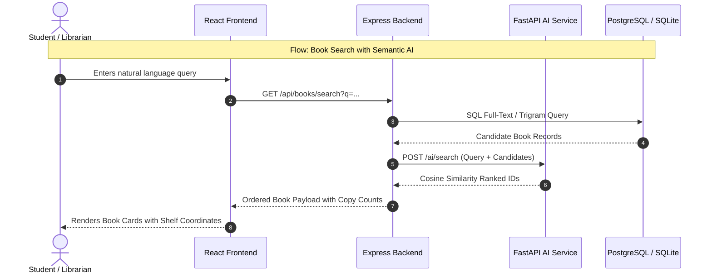

# 📚 Bookify — Technical Mastery Roadmap & Study Plan

> **Estimated Total Time:** 24 – 28 Focused Study Hours  
> **Target Audience:** Developers, Technical Leads, and System Architects mastering the Bookify codebase.  
> **Tech Stack:** React 19 + Node.js/Express + Python FastAPI + PostgreSQL/SQLite3 + Tailwind CSS  

---

## 📑 Table of Contents
1. [Executive Summary & Category Breakdown](#1-executive-summary--category-breakdown)
2. [Phase-by-Phase Learning Roadmap](#2-phase-by-phase-learning-roadmap)
   - [Phase 1: Architecture, Database & Dual-Engine Abstraction](#phase-1-architecture-database--dual-engine-abstraction-40-hrs)
   - [Phase 2: Auth, RBAC & Token Invalidation](#phase-2-auth-rbac--token-invalidation-35-hrs)
   - [Phase 3: Circulation Engine, Concurrency & Background Jobs](#phase-3-circulation-engine-concurrency--background-jobs-65-hrs)
   - [Phase 4: FastAPI Microservice & Vector AI](#phase-4-fastapi-microservice--vector-ai-35-hrs)
   - [Phase 5: Frontend Architecture & End-to-End Tracing](#phase-5-frontend-architecture--end-to-end-tracing-95-hrs)
3. [Core Request Flows to Trace](#3-core-request-flows-to-trace)
4. [Critical Code Files Index](#4-critical-code-files-index)
5. [Strategies for Accelerated Comprehension](#5-strategies-for-accelerated-comprehension)
6. [Self-Assessment Mastery Checklist](#6-self-assessment-mastery-checklist)

---

## 1. Executive Summary & Category Breakdown

To master Bookify's full-stack architecture, transactional circulation logic, semantic AI embeddings, and dual-portal frontend, study time is allocated into 6 core categories:

| Category | Description & Key Topics | Estimated Hours | Percentage |
|---|---|:---:|:---:|
| **1. Architecture & Foundations** | System topology, dual-database adapter (SQLite / Postgres), environment config, entry points, and routing guards. | **4.0 hrs** | ~15% |
| **2. Auth, Security & Session Lifecycle** | Stateless JWT issuance, role-based access control (RBAC), and in-memory `token_version` cache revocation. | **3.5 hrs** | ~13% |
| **3. Core Circulation & Business Logic** | ACID checkout/checkin transactions, row-level locking, automated waitlists, dynamic fines, and background cron jobs. | **6.5 hrs** | ~24% |
| **4. AI Microservice & Vector Search** | FastAPI microservice, `all-MiniLM-L6-v2` embeddings, semantic re-ranking, and demand forecasting. | **3.5 hrs** | ~13% |
| **5. Frontend UI & State Architecture** | Custom hooks, Axios interceptors, responsive role portals, hardware barcode event capture, and PDF streaming. | **5.5 hrs** | ~20% |
| **6. End-to-End Request Tracing & Drills** | Step-by-step tracing of critical workflows, error scenarios, and mock technical defense / code walkthroughs. | **4.0 hrs** | ~15% |
| **TOTAL** | **Comprehensive Codebase Mastery** | **27.0 hrs** | **100%** |

---

## 2. Phase-by-Phase Learning Roadmap

```
[Phase 1: Architecture & DB] ──► [Phase 2: Auth & RBAC] ──► [Phase 3: Circulation & Crons]
                                                                        │
[Phase 5: Frontend & End-to-End Tracing] ◄── [Phase 4: FastAPI & AI Service] ◄──┘
```

---

### Phase 1: Architecture, Database & Dual-Engine Abstraction (4.0 hrs)
* **Goal:** Understand the 3-tier microservice boundary, the dual-engine database layer, and environment setups.
* **Core Concepts:**
  - Dynamic SQL dialect translation (PostgreSQL `$1` parameters & date arithmetic vs SQLite `?` parameters & `strftime`).
  - Connection pooling with `pg.Pool` in production vs file-based SQLite database in local development.
  - ACID transaction wrapper (`withTransaction`) for handling auto-commit/rollback.
* **Key Files to Study:**
  - [`README.md`](file:///c:/Users/FSOS/Desktop/Bookify/README.md) & [`flow.md`](file:///c:/Users/FSOS/Desktop/Bookify/flow.md) — System entry points and startup sequencing.
  - [`backend/server.js`](file:///c:/Users/FSOS/Desktop/Bookify/backend/server.js) — Express middleware pipeline (Helmet, CORS, rate-limiters, JSON parsers, route mounting).
  - [`backend/config/db.js`](file:///c:/Users/FSOS/Desktop/Bookify/backend/config/db.js) — Database adapter and dynamic query transformation engine.
  - [`database/schema.sql`](file:///c:/Users/FSOS/Desktop/Bookify/database/schema.sql) — DDL table definitions (`users`, `books`, `book_copies`, `issues`, `book_reservations`, `fines`, `seats`).
  - [`database/seed.sql`](file:///c:/Users/FSOS/Desktop/Bookify/database/seed.sql) — Sample seed fixtures and relational linking.
* **Mastery Check:**
  - *Can you explain how `db.js` determines whether to connect to SQLite or Postgres?*
  - *How does `withTransaction()` guarantee that partial writes are rolled back if an error is thrown?*

---

### Phase 2: Auth, RBAC & Token Invalidation (3.5 hrs)
* **Goal:** Master authentication, password hashing, session lifecycles, role permissions, and real-time revocation.
* **Core Concepts:**
  - Dual-layer RBAC: Frontend route guards (`StudentRoute`, `LibrarianRoute`) + Backend middleware (`authMiddleware`, `roleMiddleware`).
  - Hybrid Token Revocation: Stateless JWT verification combined with an in-memory `token_version` cache for instant user deactivation.
  - Password reset flows via single-use numeric OTP tokens with TTL expiry.
* **Key Files to Study:**
  - [`backend/controllers/authController.js`](file:///c:/Users/FSOS/Desktop/Bookify/backend/controllers/authController.js) — Login, signup, OTP request/verify, and JWT signing logic.
  - [`backend/middleware/authMiddleware.js`](file:///c:/Users/FSOS/Desktop/Bookify/backend/middleware/authMiddleware.js) — Header extraction, JWT verification, and `token_version` cache check.
  - [`backend/middleware/roleMiddleware.js`](file:///c:/Users/FSOS/Desktop/Bookify/backend/middleware/roleMiddleware.js) — Role hierarchy enforcement (`STUDENT`, `ASSISTANT_LIBRARIAN`, `HEAD_LIBRARIAN`).
  - [`frontend/src/hooks/useAuth.jsx`](file:///c:/Users/FSOS/Desktop/Bookify/frontend/src/hooks/useAuth.jsx) — Token persistence, role parsing, and soft 401 unauthorization listeners.
* **Mastery Check:**
  - *What happens when a Head Librarian suspends a student while that student is browsing?*
  - *Why doesn't the backend require a database query on every authenticated request to verify token validity?*

---

### Phase 3: Circulation Engine, Concurrency & Background Jobs (6.5 hrs)
* **Goal:** Master book issues, returns, barcode handling, waitlist queues, overdue fines, and background workers.
* **Core Concepts:**
  - Row-Level Locking (`SELECT ... FOR UPDATE`) preventing concurrent checkout collisions.
  - Automated Waitlist & Hold Allocation: FIFO queue promotion and 24-hour pickup hold windows.
  - Dynamic Overdue Calculation: Date-delta mathematical evaluation and fine ledger recording.
  - Cron Automation: Independent worker routines running periodic expiry sweeps and notification pushes.
* **Key Files to Study:**
  - [`backend/controllers/circulationController.js`](file:///c:/Users/FSOS/Desktop/Bookify/backend/controllers/circulationController.js) — Issue, return, renew, and fine calculation routines.
  - [`backend/controllers/reservationController.js`](file:///c:/Users/FSOS/Desktop/Bookify/backend/controllers/reservationController.js) — Queue position assignment, cancellations, and hold assignments.
  - [`backend/jobs/reservationExpiryJob.js`](file:///c:/Users/FSOS/Desktop/Bookify/backend/jobs/reservationExpiryJob.js) — 5-minute cron worker that sweeps expired holds and auto-promotes the next student.
  - [`backend/jobs/dailyReminderJob.js`](file:///c:/Users/FSOS/Desktop/Bookify/backend/jobs/dailyReminderJob.js) — Daily 08:00 notification generator for pending return deadlines.
* **Mastery Check:**
  - *What exact database operations occur when an issued book is returned by a student?*
  - *How does the system ensure the next student in the waitlist gets priority when a held copy becomes available?*

---

### Phase 4: FastAPI Microservice & Vector AI (3.5 hrs)
* **Goal:** Master the Python AI service, dense vector representations, semantic ranking, and time-series demand forecasting.
* **Core Concepts:**
  - Dense Vector Embeddings: `all-MiniLM-L6-v2` generating 384-dimensional sentence vectors.
  - Hybrid Search: Full-text SQL trigram keyword search combined with cosine-similarity semantic re-ranking.
  - Demand Forecasting: Linear regression / borrowing velocity models predicting textbook scarcity prior to exam periods.
* **Key Files to Study:**
  - [`ai-service/main.py`](file:///c:/Users/FSOS/Desktop/Bookify/ai-service/main.py) — FastAPI app lifecycle, model warmup, and CORS configuration.
  - [`ai-service/services/embeddings.py`](file:///c:/Users/FSOS/Desktop/Bookify/ai-service/services/embeddings.py) — Transformer embedding generator.
  - [`ai-service/routers/search.py`](file:///c:/Users/FSOS/Desktop/Bookify/ai-service/routers/search.py) — Query-candidate similarity ranking endpoint.
  - [`ai-service/routers/forecast.py`](file:///c:/Users/FSOS/Desktop/Bookify/ai-service/routers/forecast.py) — Demand velocity forecasting endpoint.
* **Mastery Check:**
  - *How does searching for "how computers remember data" return "Database System Concepts" even without exact keyword matches?*
  - *How does the Node.js backend communicate with the FastAPI microservice during a search request?*

---

### Phase 5: Frontend Architecture & End-to-End Tracing (9.5 hrs)
* **Goal:** Master React 19 portal routing, hardware input capture, state management, and end-to-end request tracing.
* **Core Concepts:**
  - Declarative Route Guards: Partitioning routes between `/student/*` and `/lib/*`.
  - Barcode Scanner Gun Keystroke Interceptor: Detecting sub-50ms serial keyboard inputs.
  - Authenticated Digital Media Streaming: E-book PDF viewing via Blob streams with disabled static downloads.
  - Recharts Visual Analytics: Real-time circulation charts, category distributions, and inventory heatmaps.
* **Key Files to Study:**
  - [`frontend/src/App.jsx`](file:///c:/Users/FSOS/Desktop/Bookify/frontend/src/App.jsx) — Master router with route guard wrappers.
  - [`frontend/src/services/api.js`](file:///c:/Users/FSOS/Desktop/Bookify/frontend/src/services/api.js) — Central Axios instance and token injection.
  - [`frontend/src/pages/CirculationPage.jsx`](file:///c:/Users/FSOS/Desktop/Bookify/frontend/src/pages/CirculationPage.jsx) — Counter checkout/return interface with hardware scanner listener.
  - [`frontend/src/pages/BookDetailPage.jsx`](file:///c:/Users/FSOS/Desktop/Bookify/frontend/src/pages/BookDetailPage.jsx) — Shelf coordinates (Block/Rack/Shelf), copy availability, and waitlist button.
  - [`frontend/src/pages/StudentManagementPage.jsx`](file:///c:/Users/FSOS/Desktop/Bookify/frontend/src/pages/StudentManagementPage.jsx) — Student directory, suspension toggle, and borrowing limits.
  - [`BOOKIFY_COMPLETE_PROJECT_GUIDE.md`](file:///c:/Users/FSOS/Desktop/Bookify/BOOKIFY_COMPLETE_PROJECT_GUIDE.md) — Comprehensive technical reference document.
* **Mastery Check:**
  - *How does the frontend handle token expiration gracefully without triggering a hard browser reload?*
  - *How does `CirculationPage.jsx` distinguish between a human typing in a search box and a physical USB barcode scanner?*

---

## 3. Core Request Flows to Trace

To thoroughly understand the system, trace each of these 5 flows end-to-end from user interaction down to database rows:



1. **User Authentication & Route Authorization:**
   - [`Login.jsx`](file:///c:/Users/FSOS/Desktop/Bookify/frontend/src/pages/LoginPage.jsx) $\rightarrow$ `POST /api/auth/login` $\rightarrow$ [`authController.js`](file:///c:/Users/FSOS/Desktop/Bookify/backend/controllers/authController.js) $\rightarrow$ JWT issued with role & token version $\rightarrow$ [`useAuth.jsx`](file:///c:/Users/FSOS/Desktop/Bookify/frontend/src/hooks/useAuth.jsx) updates state $\rightarrow$ redirected to portal.
2. **Physical Book Checkout:**
   - [`CirculationPage.jsx`](file:///c:/Users/FSOS/Desktop/Bookify/frontend/src/pages/CirculationPage.jsx) $\rightarrow$ Scan barcode $\rightarrow$ `POST /api/issues` $\rightarrow$ [`circulationController.js`](file:///c:/Users/FSOS/Desktop/Bookify/backend/controllers/circulationController.js) $\rightarrow$ `withTransaction` $\rightarrow$ `SELECT ... FOR UPDATE` $\rightarrow$ `UPDATE book_copies` $\rightarrow$ `INSERT issues`.
3. **Book Return & Queue Fulfillment:**
   - [`CirculationPage.jsx`](file:///c:/Users/FSOS/Desktop/Bookify/frontend/src/pages/CirculationPage.jsx) $\rightarrow$ Scan copy $\rightarrow$ `PUT /api/issues/:id/return` $\rightarrow$ Compute fines $\rightarrow$ Check `book_reservations` for next student $\rightarrow$ Mark copy as `HELD` for 24 hours $\rightarrow$ Notify next student.
4. **Automated Hold Expiry (Cron Job):**
   - [`reservationExpiryJob.js`](file:///c:/Users/FSOS/Desktop/Bookify/backend/jobs/reservationExpiryJob.js) fires every 5 min $\rightarrow$ Finds `book_reservations` where `status='READY_FOR_PICKUP'` and `expiry_date < NOW()` $\rightarrow$ Marks reservation `EXPIRED` $\rightarrow$ Promotes next student in queue.
5. **Student Disciplinary Suspension:**
   - [`StudentManagementPage.jsx`](file:///c:/Users/FSOS/Desktop/Bookify/frontend/src/pages/StudentManagementPage.jsx) $\rightarrow$ Click Suspend $\rightarrow$ `PUT /api/admin/users/:id/status` $\rightarrow$ Increments `token_version` in DB and updates cache $\rightarrow$ Next API call from student fails with 401 $\rightarrow$ Session revoked.

---

## 4. Critical Code Files Index

| Priority | File Path | Why It's Critical |
|:---:|---|---|
| **#1** | [`backend/config/db.js`](file:///c:/Users/FSOS/Desktop/Bookify/backend/config/db.js) | Dual database adapter, dialect translator, transaction rollback wrapper. |
| **#2** | [`backend/middleware/authMiddleware.js`](file:///c:/Users/FSOS/Desktop/Bookify/backend/middleware/authMiddleware.js) | Enforces authentication and instant in-memory session revocation. |
| **#3** | [`backend/controllers/circulationController.js`](file:///c:/Users/FSOS/Desktop/Bookify/backend/controllers/circulationController.js) | Core library logic: transactional checkout, checkin, fine calculations. |
| **#4** | [`backend/jobs/reservationExpiryJob.js`](file:///c:/Users/FSOS/Desktop/Bookify/backend/jobs/reservationExpiryJob.js) | Automated background sweeper preventing book hoarding. |
| **#5** | [`frontend/src/App.jsx`](file:///c:/Users/FSOS/Desktop/Bookify/frontend/src/App.jsx) | Master client router, route guard barriers, soft 401 interceptors. |
| **#6** | [`ai-service/routers/search.py`](file:///c:/Users/FSOS/Desktop/Bookify/ai-service/routers/search.py) | Python FastAPI dense vector semantic search engine. |
| **#7** | [`BOOKIFY_COMPLETE_PROJECT_GUIDE.md`](file:///c:/Users/FSOS/Desktop/Bookify/BOOKIFY_COMPLETE_PROJECT_GUIDE.md) | Comprehensive master reference and technical defense guide. |

---

## 5. Strategies for Accelerated Comprehension

### 💡 Strategy 1: "Trace-and-Break" Debugging
* Don't just read code passively. Run the app, pick one controller action (e.g. `issueBook`), and add `console.log` statements at every step: parameter parsing, validation, database queries, and transaction commit.
* Intentionally throw an error before `COMMIT` to verify that the copy status does NOT change in the database.

### 💡 Strategy 2: Dual-Portal Split-Screen Testing
* Open two browser windows side-by-side:
  - **Left Window:** Logged in as **Alex Rivera** (`alex.rivera@college.edu`, Student).
  - **Right Window:** Logged in as **Dr. Sarah Jenkins** (`sarah.jenkins@college.edu`, Head Librarian).
* Place a hold on a book in the left window, then observe how the queue and copy status appear in the right window.

### 💡 Strategy 3: Inspect Database Tables Directly
* Keep SQLite / PostgreSQL CLI open:
  ```sql
  SELECT id, title FROM books;
  SELECT id, book_id, barcode, status, shelf_location FROM book_copies;
  SELECT id, user_id, book_id, queue_position, status, expiry_date FROM book_reservations;
  ```
* Observe how rows update after every action in the UI.

### 💡 Strategy 4: Use the Technical Defense Guide as a Study Anchor
* Review **Section 20 ("What Happens When...")** and **Section 21 ("SIH Technical Panel Preparation & Defense Guide")** in [`BOOKIFY_COMPLETE_PROJECT_GUIDE.md`](file:///c:/Users/FSOS/Desktop/Bookify/BOOKIFY_COMPLETE_PROJECT_GUIDE.md).
* Practice answering architectural questions out loud without looking at the code.

---

## 6. Self-Assessment Mastery Checklist

Use this checklist to track your progress:

- [ ] **Architecture:** Can explain how `db.js` translates SQL queries between SQLite and Postgres.
- [ ] **Security:** Can explain why token versioning allows instant session revocation without database lookups on every request.
- [ ] **Circulation:** Can explain how database row locks prevent duplicate book issues.
- [ ] **Waitlists:** Can trace how returning a book triggers a 24-hour hold and how the cron job expires it.
- [ ] **AI Search:** Can explain the flow between React $\rightarrow$ Express $\rightarrow$ FastAPI $\rightarrow$ `all-MiniLM-L6-v2` $\rightarrow$ Cosine Re-ranking.
- [ ] **Frontend:** Can explain how `CirculationPage.jsx` captures rapid barcode scanner keystrokes.
- [ ] **Error Handling:** Can explain how soft 401 handling prevents disruptive full-page reloads.
